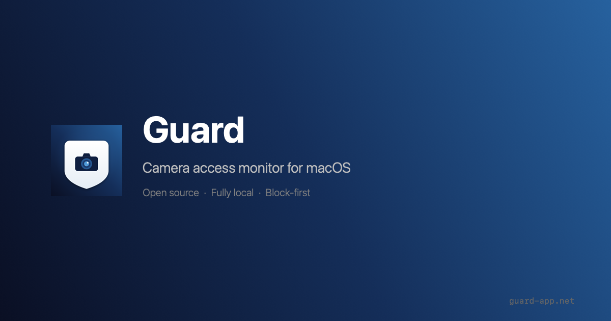

<p align="center">
  
</p>

<h1 align="center">Guard</h1>

<p align="center">
  <strong>Camera access monitor for macOS</strong><br>
  Block-first. Open source. Fully local.
</p>

<p align="center">
  <a href="https://github.com/FaisalFehad/Guard/releases/download/v1.0.0/Guard.dmg">Download DMG</a> ·
  <a href="https://guard-app.net">Website</a> ·
  <a href="https://github.com/FaisalFehad/Guard/issues">Report Bug</a>
</p>

<p align="center">
  
  
  
  
</p>

---

Guard sits in your menu bar and monitors your Mac's camera. The moment any process tries to access the camera, Guard **freezes it instantly** — before it can read a single frame — and asks you what to do.

<p align="center">
  
</p>

## How it works

```
App opens camera
       │
       ▼
Guard detects (~500ms)
       │
       ▼
SIGSTOP — process is FROZEN
(can't read camera frames)
       │
       ▼
Alert: "Allow or Block?"
      / \
   Allow  Block
     │      │
  SIGCONT  SIGTERM
  (resume) (kill)
```

1. **Detect** — Polls CoreMediaIO's `kCMIODevicePropertyDeviceIsRunningSomewhere` every 500ms
2. **Freeze** — Sends `SIGSTOP` to the offending process (kernel-level, cannot be caught or ignored)
3. **Decide** — You choose: Allow, Block, or Always Block

## Features

- **Block-first** — Processes are frozen before they can read a single frame
- **Real-time monitoring** — 500ms camera state polling via CoreMediaIO
- **Permanent block list** — Auto-blocks untrusted apps silently on future attempts
- **Activity log** — Full history with process name, PID, bundle ID, and timestamps
- **Flashing menu bar icon** — Red flash when camera is active
- **30s approval timeout** — Auto-blocks if you don't respond
- **Launch at login** — Optional, via LaunchAgent
- **Fully local** — No network calls, no telemetry, no accounts
- **Tiny footprint** — ~250KB binary, minimal CPU usage

## Install

### Homebrew

```bash
brew install --cask guard
```

### Download

Grab the latest DMG from the [releases page](https://github.com/FaisalFehad/Guard/releases/download/v1.0.0/Guard.dmg).

### Build from source

```bash
git clone https://github.com/FaisalFehad/Guard.git
cd Guard
./build.sh
open build/Guard.app
```

Requires `swiftc` (included with Xcode Command Line Tools). Run `xcode-select --install` if you don't have it.

## Requirements

- macOS 14 (Sonoma) or later
- Apple Silicon or Intel

## How it's built

| Component | Technology |
|---|---|
| Camera detection | CoreMediaIO (`kCMIODevicePropertyDeviceIsRunningSomewhere`) |
| Process freezing | POSIX signals (`SIGSTOP` / `SIGCONT` / `SIGTERM`) |
| UI | AppKit (NSStatusItem, NSAlert, NSTableView) |
| Persistence | JSON file (activity log) + UserDefaults (block list) |
| Launch at login | LaunchAgent plist |
| Build | Direct `swiftc` compilation — no Xcode project needed |

## Limitations

- **Detection, not prevention.** Guard detects camera access and reacts (~500ms). A true zero-gap blocker would require a kernel extension or Apple-signed Camera Extension.
- **Process identification is heuristic.** macOS doesn't expose a "who has the camera" API. Guard uses a scoring system (frontmost app, known camera apps) to identify the process. It's usually right, but background processes may be misidentified.
- **SIGSTOP requires same-user ownership.** Guard can freeze apps you own. System processes owned by root require `sudo`.

## Privacy

Guard collects **zero data**. No network calls. No analytics. No telemetry. No accounts. Everything runs locally on your Mac. The activity log is stored in `~/Library/Application Support/Guard/` and never leaves your machine.

## License

[MIT](LICENSE)

## Contributing

Issues and pull requests are welcome. If you find a bug or have a feature request, please [open an issue](https://github.com/FaisalFehad/Guard/issues).
